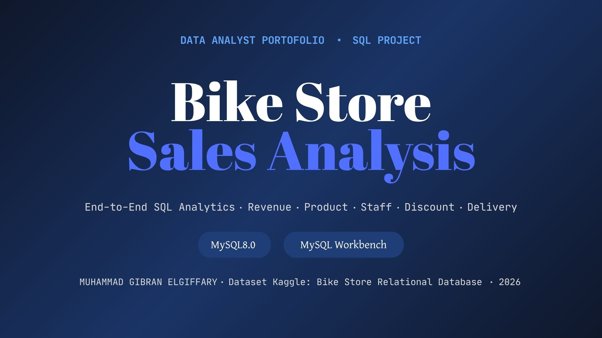
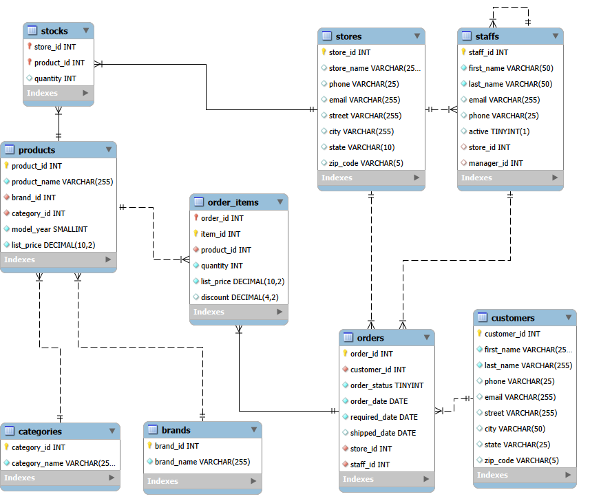
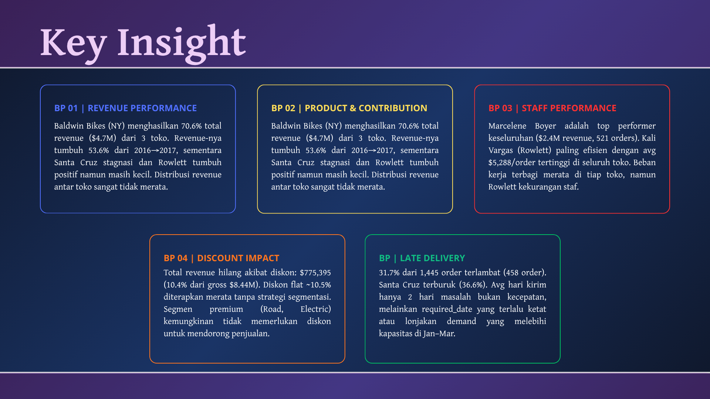

# 🚲 Bike Store Sales Analysis

An end-to-end SQL analytics project on a fictional bike store chain from building the relational database to answering real business questions with structured queries.



---

## 📌Project Overview

This project analyzes operational data from a 3-store bike retail chain across the US (California, New York, Texas) covering January 2016 to March 2018. The goal was to extract actionable business insights across five dimensions using MySQL on a 9-table relational database.

It's structured in three stages:
1. **Database Setup:** create schema, define tables, import 9 CSV files
2. **Data Understanding:** explore structure, map relationships (ERD), check for NULLs
3. **SQL Analysis:** write queries to answer 5 business problems

---

## Database at a Glance

| | |
|---|---|
| **Source** | [Kaggle - Bike Store Sample Database](https://www.kaggle.com/datasets/dillonmyrick/bike-store-sample-database) by Dillon Myrick |
| **Total tables** | 9 |
| **Total rows** | 9,071 |
| **Orders** | 1,615 |
| **Customers** | 1,445 |
| **Gross revenue** | $8.44M (before discount) |
| **Net revenue** | $6.66M (after discount) |
| **Period** | Jan 2016 – Mar 2018 |

### Entity Relationship Diagram



### Tables

**Sales Group**
| Table | Rows | Description |
|---|---|---|
| customers | 1,445 | Customer identity and contact info |
| orders | 1,615 | Transaction headers: date, status, store, staff |
| order_items | 4,722 | Line items: product, quantity, price, discount |
| stores | 3 | Santa Cruz CA · Baldwin NY · Rowlett TX |
| staffs | 10 | Staff roster and store assignments |

**Production Group**
| Table | Rows | Description |
|---|---|---|
| products | 321 | Product catalog: name, brand, category, price |
| categories | 7 | Mountain, Road, Cruisers, Electric, and more |
| brands | 9 | Trek, Electra, Surly, Haro, and others |
| stocks | 939 | Per-store inventory levels |

> `order_status` values: 1=Pending, 2=Processing, 3=Rejected, 4=Completed

---

## Tools

| Tool | Used for |
|---|---|
| MySQL 8.0 | Database engine — create tables, store data, run all queries |
| MySQL Workbench | GUI — query editor, import wizard, ERD visualization |

---

## Business Problems & Findings

### BP 01 - Revenue Performance per Store & Year

> Which store is the most profitable? Is there a growth trend?

Baldwin Bikes (NY) generates **70.6% of total revenue ($4.7M)** despite being just one of three stores. Its revenue grew **53.6% from 2016 to 2017**. Santa Cruz stayed flat around $544K/year. Rowlett is the smallest but grew 51.7% in the same period.

**SQL techniques:** `SUM()`, `YEAR()`, `GROUP BY`, `ORDER BY`

---

### BP 02 - Product Category Analysis

> Which categories drive the most revenue? What's the % contribution of each?

Mountain Bikes lead with **37.3% of revenue ($2.49M)**, but Cruisers actually sell the most units (1,865). Road Bikes rank 2nd in revenue at $1.33M (19.9%) with far fewer units — clear premium segment. The top 2 categories together account for **57.2% of total revenue**.

**SQL techniques:** `RANK() OVER()`, `SUM(SUM()) OVER()` for % contribution, multi-table JOIN

---

### BP 03 - Staff Performance Ranking

> Who handles the most orders and generates the most revenue? Who's the most efficient?

Marcelene Boyer (Baldwin) is the overall top performer with **$2.4M revenue across 521 orders**. Kali Vargas (Rowlett) has the highest average per order at **$5,288** beating all Baldwin staff despite lower volume. Workload is distributed fairly evenly within each store.

**SQL techniques:** `DENSE_RANK() OVER (PARTITION BY store_id)`, `CONCAT()`, `COUNT(DISTINCT)`

---

### BP 04 - Discount Impact Analysis

> How much revenue is lost to discounts? Is the flat-rate discount strategy working?

**$775,395 in revenue was lost** (10.4% of gross $8.44M). The discount is applied uniformly across all 7 categories at ~10–11% with no segmentation. Mountain Bikes lost the most ($293K) not because it had the highest discount rate, but because of its sales volume. Road Bikes and Electric Bikes are likely premium enough that discounting them isn't necessary.

**SQL techniques:** computed columns (gross vs net vs leakage), `AVG(discount)`

---

### BP 05 - Order Fulfillment & Late Delivery

> How often are orders late? Which store is worst? Is it a speed problem or a scheduling problem?

**31.7% of 1,445 shipped orders were late** (458 orders). Santa Cruz is worst at 36.6%, Rowlett best at 26.1%. The key finding: average shipping time is only **2 days across all stores** meaning the problem isn't slow processing. It's that `required_date` is set too tight, or demand spikes in Jan–Mar push stores past capacity.

**SQL techniques:** `DATEDIFF()`, `SUM(CASE WHEN)`, `AVG()`, `WHERE IS NOT NULL`

---

## Key Findings Summary



| Business Problem | Key Number | Finding |
|---|---|---|
| Revenue | Baldwin = 70.6% | Extremely uneven distribution across 3 stores |
| Products | Mountain Bikes = 37.3% | High-revenue category despite not being top unit seller |
| Staff | Boyer = $2.4M | Top revenue; Vargas most efficient at $5,288/order |
| Discount | $775K lost | Flat-rate discount applied with no segmentation |
| Delivery | 31.7% late | Problem is deadline-setting, not shipping speed |

---

## How to Reproduce

```bash
git clone https://github.com/Girban28/bike-store-sql-analytics.git
```

1. Open MySQL Workbench and create a new schema: `bike_store`
2. Run the SQL files in order:
```
01_create_tables.sql      ← create all 9 tables
02_data_understanding.sql ← null checks
03_bp01_revenue.sql       ← and so on
```
3. Import the CSV files using **Table Data Import Wizard** after creating each table
4. Dataset download: [Kaggle - Bike Store Sample Database](https://www.kaggle.com/datasets/dillonmyrick/bike-store-sample-database)

> ⚠️ CSV files are not included in this repository due to Kaggle's license. Please download directly from the link above.

---

## About

**Muhammad Gibran Elgiffary**
[LinkedIn](https://linkedin.com/in/gibranelgiffary) · [GitHub](https://github.com/Girban28)

Dataset by Dillon Myrick — fictional data for educational use.
